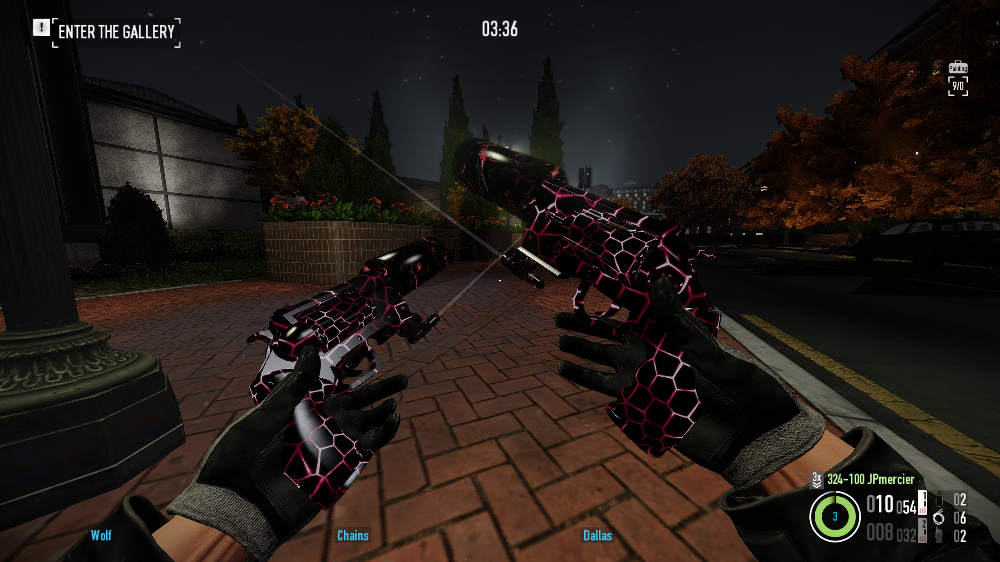
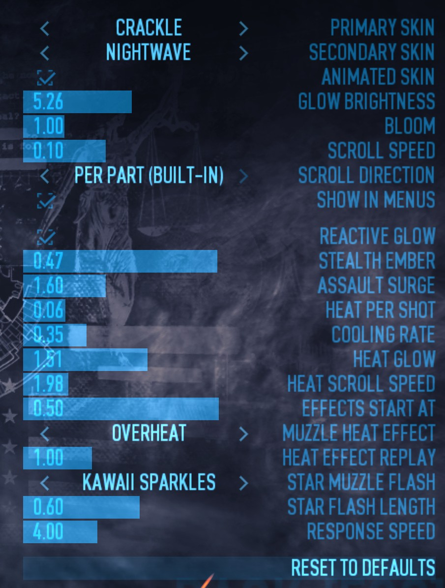

# AnimSkins

Animated glowing weapon skins for PAYDAY 2, applied to the local player's first-person weapons only. 14 skins, switchable in game through the included AnimSkins Tuner.

Made by Yuna. Built on [Inversion Universal](https://github.com/JP-mercier/PD2-Animated-Weapon-Skin) by [Siuna](https://steamcommunity.com/profiles/76561199075375622).

Skins: Eldritch Rose, Crackle, Crystal, Interstellar, Inversion, Molton, Nebula, Nightwave, Pap Galaxy, Purple, Scribble, Shatter, Starfall, Inversion Universal.



## Requirements

- [SuperBLT](https://superblt.znix.xyz/)
- [BeardLib](https://modworkshop.net/mod/14924)

## Installation

1. Download the latest release zip, or the repository (Code → Download ZIP).
2. Copy the two folders in `mods/` (`AnimSkins`, `AnimSkins Tuner`) into `PAYDAY 2/mods/`.
3. Remove anything that swaps the same materials. For the two old packs this is automatic: at the main menu AnimSkins offers to move them to `PAYDAY 2/AnimSkins old versions/`, out of the game's reach (a restart finishes it), and `python tools/build.py --install` does the same. Nothing is deleted.

| Path | Why |
| --- | --- |
| `PAYDAY 2/assets/mod_overrides/AnimSkins` | The 1.x pack. It skins every weapon in the game, and third-person weapons show through walls. |
| `PAYDAY 2/assets/mod_overrides/AnimSkinsGloves` | Dropped in 3.1. It overrides the game's glove materials for every player. |
| `PAYDAY 2/mods/Inversion Universal` | Swaps the same parts. Whichever hook runs last wins. |

AnimSkins Tuner requires AnimSkins. AnimSkins works on its own, showing the default skin.

## Scope

| Applied | Not applied |
| --- | --- |
| Your own weapons, first person | Teammates, bots, enemies, lobby characters |
| Weapons wearing a game weapon skin (covered by the animated skin) | Melee weapons and throwables |
| Inventory and customization previews (optional, see the Tuner's `Show in menus`) | Custom weapons added by other mods |
| 1,766 vanilla weapon parts | VR |

Magazines (188 parts) are drawn solid black with no glow. Set `BLACK_PARTS = False` in `tools/build.py` and rebuild to animate them.

**Known gap.** The part data does not cover 144 part configs the game has. Most are optics (Aimpoint, EOTech, ACOG, Specter, T1 Micro, the reflex/holo/magnifier family, back-up iron sights). The rest are the Chimano 88's barrel and body, every part of the PMM, Bleckert, Speen and Dart, some quick-mags, charms, belt-fed bullets, and a few legendary-skin parts (Model 70, Minigun, KSG, flamethrower). These stay vanilla. Covering one requires its exact material names in `src/parts.txt`. Guessing them puts effect shaders on the wrong meshes.

## AnimSkins Tuner

Options → Mod Options → AnimSkins Tuner. Changes apply immediately, with no restart. Reset to defaults restores the defaults listed below.



| Setting | Default | Effect |
| --- | --- | --- |
| Primary skin / Secondary skin | Eldritch Rose | Skin per weapon slot. Every skin is loaded at startup, so switching is instant |
| Animated skin | On | Off sets glow and scroll to zero, leaving the base texture |
| Glow brightness | 5 | `il_multiplier`. Above about 10 the bright parts clip to white. 0 turns the animation off |
| Bloom | 1.0 | `il_bloom`, how far the glow bleeds past the weapon. Requires bloom in the video settings |
| Scroll speed | 0.1 | `uv_speed`, UV units per second. 0 freezes the pattern |
| Scroll direction | Per part (built-in) | Right, left, down, up, diagonal, or each material's own direction. UV islands are rotated and mirrored per part, so per part reads the most even |
| Show in menus | On | Off keeps inventory and customization previews vanilla. Applies to weapons built after the change |

Reactive glow (on by default) scales the glow brightness with the heist state and weapon heat:

| Setting | Default | Effect |
| --- | --- | --- |
| Stealth ember | 0.35 | Glow factor while the level is in stealth |
| Assault surge | 1.6 | Glow factor during an assault. The build-up reaches 40% of it |
| Heat per shot | 0.06 | Heat added per shot, 0 to 1 scale (about 17 shots to full heat) |
| Cooling rate | 0.35 | Heat lost per second while not firing |
| Heat glow | 1.5 | Extra glow at full heat, as a multiple of the current glow |
| Heat scroll speed | 3.0 | Scroll speed multiplier at full heat |
| Effects start at | 0.5 | Heat level where the muzzle heat effect switches on |
| Muzzle heat effect | Overheat | Looping particle effect at the muzzle while hot, from the game's library |
| Heat effect replay | 1.0 | Seconds between replays of the heat effect while the weapon stays hot |
| Star muzzle flash | Kawaii sparkles | Particle effect fired from the muzzle on every shot |
| Star flash length | 0.6 | Seconds each star flash lives |
| Response speed | 4.0 | How fast the glow follows heist state changes |

Settings are stored in `mods/saves/animskins_tuner.json`. Settings saved by 2.0 and earlier (`glitchwave_tuner.json`) are read if the new file does not exist yet.

## How it works

**Material swap (`mods/AnimSkins/lua/animskins.lua`).** No game file is overridden. Animated material configs are registered under `units/mods/animskins3/` through BeardLib and put on the parts of weapons where `is_npc()` is false. Each part is matched by the Idstring of its vanilla material config (`part_data.material_config`, falling back to `part_data.unit`).

- *Unskinned weapons* are swapped in a post-hook on `NewRaycastWeaponBase:_update_materials`.
- *Skinned weapons* get the config through the game's skin system. For those, vanilla `_update_materials` asks `_material_config_name` which config each part should wear, applies it, and paints the skin onto materials with a `wear_tear_value` variable. AnimSkins answers `_material_config_name` with its own config, so the skin system applies it once, finds nothing to paint, and requests no textures. Replacing the skin's `_cc` config afterwards instead destroys materials the skin system is still loading textures for. This crashed the renderer on skinned akimbo weapons.
- *Loading.* `main.xml` loads every config and texture at startup (`load="true"`). A part is only swapped once its config reports loaded (`DynamicResourceManager:is_resource_ready`). A part skipped this way is picked up the next time the weapon updates its materials.

After each swap, `AnimSkins.swapped[weapon]` records the part units and configs, and `Hooks:Call("AnimSkinsSwapped", weapon, swapped)` notifies listeners.

**Tuner (`mods/AnimSkins Tuner/`).** Writes only to part units AnimSkins swapped, only while they still wear that config, and only to the materials `skin_materials.txt` lists for it: animated materials (both textures) and static materials showing the skin's base (diffuse only). Scope glass, reticles and lasers are never touched. `Application:set_material_texture` on a material without that texture slot faults in the render thread, and `pcall` cannot catch it. Textures are bound only once the engine reports them loaded. Settings are re-applied from the `AnimSkinsSwapped` hook, because `set_material_config` rebuilds a unit's materials.

**Configs.** Each part declares only the materials its mesh uses, first-person variant only. The 1,766 parts come out as 408 files, because parts whose configs are byte-identical share one.

**Textures.** Skin textures are 1024×1024 DXT1 without mipmaps. They are fully opaque, so a DXT5 texture's alpha blocks carry nothing. The build rewrites an opaque DXT5 as DXT1 in place, keeping each colour block bit for bit, and verifies the result decodes pixel-identical (when Pillow is installed).

## Repository layout

```
mods/
    AnimSkins/                          the skins; install as is
        mod.txt                         BLT manifest, registers the Lua hook
        lua/animskins.lua               material swap
        lua/cleanup.lua                 main-menu prompt to retire old mod_overrides packs
        assets/units/mods/animskins3/
            <id>_df.texture             base texture per skin
            <id>_il.texture             glow texture per skin
            black.texture               magazines                          (generated)
            materials/*.material_config                                    (generated)
        main.xml                        BeardLib file registration         (generated)
        material_configs.txt            vanilla config -> AnimSkins config (generated)
        skin_materials.txt              retexturable materials per config  (generated)
        variants.json                   skin list for the tuner            (generated)
    AnimSkins Tuner/                    the in-game menu; install as is
src/
    parts.txt, animated.txt, static.xml weapon part data, from Inversion Universal
    black_parts.txt                     parts drawn black
    skins.json                          skin ids and names, in dropdown order
tools/build.py                          generates the files above, installs, packs
docs/                                   README screenshots
```

Generated files are committed so the repository can be installed directly. Do not edit them by hand.

## Building

Requires Python 3.10 or newer. Pillow is optional and enables the texture check.

```
python tools/build.py                  # build in place
python tools/build.py --install        # build, copy both mods into PAYDAY 2/mods (found through Steam), retire old packs
python tools/build.py --install <PD2>  # same, with an explicit PAYDAY 2 folder
python tools/build.py --pack           # build, then write dist/AnimSkins-<version>.zip
```

The build stops before writing anything on duplicate skin ids, missing or malformed textures, textures no skin uses, unknown materials or scroll directions, and configs referencing unregistered textures.

Defaults baked into the configs are at the top of `tools/build.py`: `DEFAULT_SKIN`, `SCROLL_SPEED`, `GLOW_MULTIPLIER`, `GLOW_BLOOM`, `BLACK_PARTS`. The Tuner overrides them at runtime.

**Adding a skin.** Save the base and glow textures as `<id>_df.texture` and `<id>_il.texture` in `mods/AnimSkins/assets/units/mods/animskins3/`. Use DDS, DXT1 or DXT5, no mipmaps, power-of-two size. Append `{ "id": "<id>", "name": "<name>" }` to the end of `src/skins.json`: the Tuner saves skins by position. Then rebuild and restart the game.

## Troubleshooting

At startup, `mods/logs` shows `[AnimSkins] 1766 weapon parts mapped`, then `swap #N: X of Y parts, Z waiting for their config to load` for the first 20 weapons. Parts that were waiting pick the skin up the next time the weapon is rebuilt (re-equip it).

| Symptom | Cause |
| --- | --- |
| Nothing changes | Configs and textures are registered at startup only. Restart the game fully. |
| Every weapon glows, or weapons show through walls | `assets/mod_overrides/AnimSkins` (1.x) is still installed. |
| Crash | Disable AnimSkins Tuner in the BLT mod manager first. That leaves the swap running with nothing writing to materials at runtime, and tells you which mod is at fault. Keep `mods/logs/<date>_log.txt`: it is replaced on the next launch. Relevant lines start with `[AnimSkins]`. |

## Changelog

### 3.1 (Tuner 2.1)
- Single repository: both mods under `mods/`, sources under `src/`, one build script.
- Part data is part of the repository instead of read from a copy of Inversion Universal.
- Skin textures are stored once, in the mod folder, instead of a DXT5 source copy plus a DXT1 build copy.
- `--install` finds PAYDAY 2 through Steam, installs both mods, and moves the 1.x and gloves `mod_overrides` packs to `PAYDAY 2/AnimSkins old versions/`. `--pack` replaces `pack.py`.
- Removed the AnimSkinsGloves `mod_overrides` pack. When it or the 1.x pack is still installed, a main-menu prompt offers to move it to `PAYDAY 2/AnimSkins old versions/` (`lua/cleanup.lua`).
- Tuner settings file renamed to `animskins_tuner.json`. The old file is still read.

### 3.0 (Tuner 2.0)
- Rebuilt on Inversion Universal's engine and part data: first-person weapons of the local player only. 8,417 files (1.1 GB) reduced to 443 (69 MB).
- Skinned weapons receive the config through `_material_config_name`, which fixes the renderer crash on skinned akimbo weapons.
- Tuner writes only to materials AnimSkins swapped. Added per-slot skins, `Show in menus` and the reactive glow.

### 1.x
- `mod_overrides` pack covering every material config path in the hashlist.
